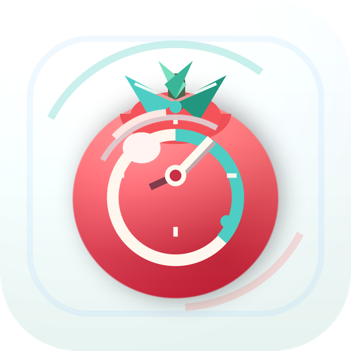

<div align="center">



# TomatoClock

**一款内置 MCP 服务器的番茄钟专注计时器**

让任意 AI Agent 用自然语言或任意文件格式，把计划直接写进你的番茄钟。

SwiftUI macOS 原生应用 ＋ Tauri 跨平台桌面端

</div>

---

## ✨ 特色功能

### 内置 MCP，外部 Agent 直连导入计划

TomatoClock 内置了一个遵循 [Model Context Protocol](https://modelcontextprotocol.io) 的 `tomato-clock-mcp` 服务器。任何支持 stdio MCP 的外部 Agent——Claude Code、Claude Desktop、Cursor、Codex CLI 等——都能把工作计划直接送进应用：

- **自然语言**：「帮我把刚才那段会议记录排成明天的番茄钟计划」
- **任意文件格式**：Markdown、CSV、JSON、任务软件导出、网页链接……应用本身不去解析这些格式——**格式转换交给 Agent，应用只维护一份严格校验的数据契约**（Plan Schema v1），导入面因此极小、极可靠

整个工作流「人在环上」（human-in-the-loop）：


1. 在应用内创建导入会话，对话框给出**可直接复制**的 MCP 客户端配置
2. 把配置贴进任意 MCP 客户端，用自然语言让 Agent 生成计划
3. Agent 调用 `import_plan`，计划通过严格校验后**暂存**（不直接写库）
4. 你在应用里预览摘要（标题、分区数、任务数、前 5 条任务），**确认后才真正导入**；随时可取消，会话 30 分钟自动过期

安全设计：暂存与落库分离 · 会话一次性 · 已导入 / 已取消 / 已过期后拒绝再写入 · 会话文件原子写入。

#### MCP 工具

| 工具 | 说明 |
|---|---|
| `import_plan` | 暂存一份 Plan Schema v1 计划，返回标题、分区数、任务数与预览摘要 |
| `get_import_status` | 读取当前导入会话状态与已暂存计划的摘要 |

MCP 客户端配置（由应用对话框生成，一键复制）：

```json
{
  "mcpServers": {
    "tomato-clock-import": {
      "command": "<tomato-clock-mcp 可执行文件路径>",
      "args": ["--session", "<本次导入会话的 JSON 路径>"]
    }
  }
}
```

#### Plan Schema v1

```json
{
  "schemaVersion": 1,
  "title": "周五产品迭代日",
  "summary": "从 PRD 与会议记录整理出的一天专注计划",
  "source": { "kind": "markdown", "url": "file:///Users/ray/notes/plan.md" },
  "currentItemExternalID": "jira-1283",
  "sections": [
    {
      "title": "上午 · 深度开发",
      "items": [
        {
          "title": "实现导入会话过期逻辑",
          "estimatedMinutes": 50,
          "priority": "high",
          "externalID": "jira-1283"
        },
        { "title": "补充覆盖导入的单元测试", "estimatedMinutes": 25, "priority": "normal" }
      ]
    },
    {
      "title": "下午 · 评审与收尾",
      "items": [
        { "title": "评审桌面端托盘交互", "estimatedMinutes": 25, "priority": "normal" },
        { "title": "整理一周专注统计", "priority": "low" }
      ]
    }
  ]
}
```

校验规则：`schemaVersion` 必须为 1；计划与分区标题必填；每个分区至少一条任务；`estimatedMinutes` 必须为正数；`priority` 仅接受 `low` / `normal` / `high`。

#### 覆盖导入，不丢进度

对同一份计划反复导入时（比如任务在源系统里更新了），TomatoClock 按 `externalID` → 「分区标题 ＋ 任务标题」的顺序匹配新旧条目，**保留已完成状态、完成时间与当前进行中的任务**。

手边没有 MCP 客户端？也可以在导入对话框里直接粘贴同样的 JSON 暂存——两条路走的是同一套校验。

### 计时本身也足够精致

两个平台共有的核心体验：

- 经典 25 / 5 / 15 番茄循环，每 4 轮专注进入一次长休息，阶段自动衔接
- 基于 `Date` 差值的倒计时，系统睡眠、窗口隐藏后依然准确
- 菜单栏 / 系统托盘常驻：进度环小图标、快捷控制，关闭窗口不退出
- 阶段结束时的原生系统通知 ＋ 轻柔钟声
- 工作计划：分区 / 任务、优先级、预估时长、当前任务指针
- 7 天专注统计柱状图，每日目标（默认 8 🍅）

## 📦 两个应用

| | macOS 原生版 | 跨平台桌面版 |
|---|---|---|
| 目录 | 仓库根目录 | `apps/tomatoclock-desktop` |
| 技术栈 | Swift 6 · SwiftUI · SwiftData · Swift Charts | Tauri v2 · React 19 · TypeScript · SQLite |
| 平台 | macOS 26+ | Windows 优先，兼顾 macOS / Linux |
| MCP 导入 | ✅（需自行构建 helper） | ✅（MCP sidecar 随应用打包） |

### macOS 原生版

充分利用 macOS 26 Liquid Glass 材质：玻璃折射出当前阶段的主题色晕——专注（珊瑚红）、短休息（薄荷绿）、长休息（天空蓝），随阶段切换平滑过渡。

### 跨平台桌面版

Tauri v2 ＋ React 19 重写的跨平台移植版：托盘菜单、单实例、关闭到托盘、SQLite 持久化，Vitest 覆盖计时与导入语义的单元测试。

## 🔨 构建与运行

### macOS 原生版

需要 Xcode 26+（macOS 26 SDK）：

```bash
open TomatoClock.xcodeproj   # ⌘R 直接运行
```

MCP 导入功能需要 `tomato-clock-mcp` 可执行文件（原生版按 `script/tomato-clock-mcp`、`~/Documents/TomatoClock/script/tomato-clock-mcp`、`PATH` 的顺序查找）：

```bash
cd apps/tomatoclock-desktop/src-tauri
cargo build --release --bin tomato-clock-mcp
```

### 跨平台桌面版

```bash
cd apps/tomatoclock-desktop
npm install
npm run tauri:dev    # 开发调试
npm test             # Vitest 单元测试
npm run tauri:build  # 打包
```

Windows 交叉构建与 sidecar 命名规则见 [apps/tomatoclock-desktop/README.md](apps/tomatoclock-desktop/README.md)。

## 🗂 项目结构

```
TomatoClock/
├── TomatoClock.xcodeproj                  # macOS 原生应用工程
├── TomatoClock/                           # SwiftUI 源码
│   ├── Models/                            # 计时引擎、工作计划、导入契约
│   ├── Services/                          # 导入会话管理
│   └── Views/                             # 主窗口、计划面板、导入对话框等
├── TomatoClockTests/                      # 计时、计划、导入会话单元测试
└── apps/tomatoclock-desktop/              # Tauri 跨平台桌面版
    ├── src/                               # React + TypeScript 前端与领域模型
    └── src-tauri/
        ├── src/bin/tomato-clock-mcp.rs    # 内置 MCP 服务器（stdio）
        └── migrations/                    # SQLite 初始结构
```

## 📐 设计文档

产品设计（视觉、计时模型、数据模型）见 [PLAN.md](PLAN.md)。
